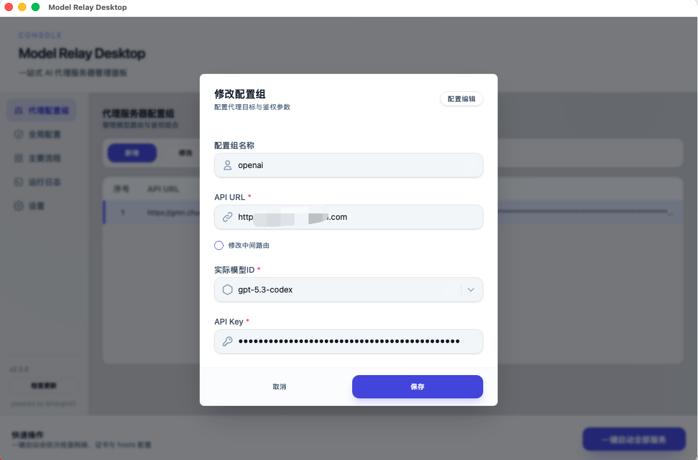

# Model Relay Desktop

<picture>
    
</picture>

[](docs/README.en.md) [](README.md) [](docs/README.ja.md) [](docs/README.ko.md) [](docs/README.es.md) [](docs/README.fr.md) [](docs/README.pt.md) [](docs/README.de.md) [](docs/README.ru.md)

## 简介

Model Relay Desktop 是一个面向开发者的本地代理桌面工具，用于把 IDE（如 Trae）请求路由到你自定义的模型服务商，适用于 Windows 和 macOS。

你可以把它理解为：**本地可控、可视化配置、可快速排障的模型中转控制台**。

**v3.0 开始，支持在 Trae 中配置并使用 OpenAI 协议与 Claude（Anthropic Messages）协议。**

> 关键词：Trae 代理、OpenAI 协议、Claude 协议、Anthropic Messages、本地模型中转。

## 二次开发变更概览（相对上游）

本仓库在上游基础上，重点做了以下增强：

- **双协议接入**：支持 OpenAI `chat/completions` 与 Claude `messages` 协议。
- **Trae 配置可视化**：在同一桌面端管理多配置组，并切换当前生效组。
- **鉴权兼容增强**：兼容 `Authorization`、`Proxy-Authorization`、`x-api-key`、`api-key` 等常见入口头。
- **流式稳定性增强**：补齐 SSE 分隔并做换行归一化，降低流式中断概率。
- **排障能力增强**：运行日志增加可读性优化与自动滚动，支持快速定位问题。

### v3.0 重点更新

- 支持 Trae 中添加 `OpenAI` 服务商模型与 `Anthropic` 服务商模型。
- 支持本地代理以配置组方式切换 OpenAI / Claude 上游协议。
- 强化“全局入口配置”语义，降低多协议并存时的误解成本。

## 开源与来源说明

- 本仓库是基于上游项目 `BiFangKNT/mtga` 的二次开发版本，非上游官方发布。
- 上游项目地址：<https://github.com/BiFangKNT/mtga>
- 本仓库遵循并保留上游采用的 `GNU AGPLv3` 协议，详见 [LICENSE](LICENSE)。
- 若你对外提供网络服务或分发二进制，请按 AGPL 要求提供对应源码与协议声明。
- 本仓库未与任何第三方品牌形成官方合作或背书关系。

## 目录

- [Model Relay Desktop](#model-relay-desktop)
  - [简介](#简介)
  - [二次开发变更概览（相对上游）](#二次开发变更概览相对上游)
    - [v3.0 重点更新](#v30-重点更新)
  - [开源与来源说明](#开源与来源说明)
  - [目录](#目录)
  - [更新日志](#更新日志)
  - [快速开始](#快速开始)
    - [安装](#安装)
      - [Windows](#windows)
      - [macOS](#macos)
    - [使用](#使用)
  - [全局入口配置说明（多协议）](#全局入口配置说明多协议)
  - [合规与使用边界](#合规与使用边界)
  - [macOS 解决 “包已损坏” 问题](#macos-解决-包已损坏-问题)
    - [图形化解决方案](#图形化解决方案)
    - [cli 解决方案](#cli-解决方案)
  - [trae 端提示 “添加模型失败” 的排查方案](#trae-端提示-添加模型失败-的排查方案)
  - [配置 Trae / Cursor IDE（OpenAI + Claude）](#配置-trae--cursor-ideopenai--claude)
  - [GitHub 搜索优化（SEO）](#github-搜索优化seo)
  - [😎 保持更新](#-保持更新)
  - [贡献](#贡献)
  - [架构与依赖约束](#架构与依赖约束)
  - [引用](#引用)
  - [Star History](#star-history)

---

## 更新日志

最新日志详见： [最新发行版](https://github.com/xiaoliuzhuan/model-relay-desktop/releases/latest)

历史日志归档： [CHANGELOG.md](CHANGELOG.md)

---

## 快速开始

### 安装

#### Windows

1. 从 [GitHub Releases](https://github.com/xiaoliuzhuan/model-relay-desktop/releases) 下载最新版本的安装包
2. 双击安装

#### macOS

1. 从 [GitHub Releases](https://github.com/xiaoliuzhuan/model-relay-desktop/releases) 下载最新版本的 DMG 包
   - `{arch}` 为指令集架构：
     - `x64`：Intel 处理器
     - `aarch64`：Apple Silicon 处理器（M 系列）
2. 双击 DMG 文件，系统会自动挂载安装包
3. 将 `Model Relay Desktop.app` 拖拽到 `Applications` 文件夹

### 使用

1. 启动 Model Relay Desktop 应用程序。
2. 添加代理配置组（可创建多个配置组，例如 OpenAI 一组、Claude 一组）。
   - **API URL 只需要填域名（端口号可选，不懂就不要填），不需要填后面的路由，例如：`https://your-api.example.com`**
   - 如果接口不是标准 `/v1` 路由，可在配置组中设置“中间路由”。
   - 配置组内的 `上游协议 / API URL / 上游模型ID / 上游 API Key` 只对该组生效。
   - 图一（添加代理组）：
     
3. 填写全局入口配置。
   - `客户端映射模型ID`：Trae 里填写的模型名（统一入口名）。
   - `客户端访问Key`：Trae 访问本地代理时使用的入口密钥。
   - 这两项是全局入口参数，**不是**上游厂商 API 参数。
   - 图二（全局配置页）：
     
   - 图三（Trae 添加模型示意）：
     
4. 选择当前要生效的配置组，点击“一键启动全部服务”（macOS 需要管理员权限）。
5. 等待程序自动完成以下操作：
   - 生成并安装证书
   - 修改 hosts 文件
   - 启动代理服务器
6. 完成后，按照[配置 Trae / Cursor IDE（OpenAI + Claude）](#配置-trae--cursor-ideopenai--claude)进行 IDE 配置。

> [!NOTE]
>
> - 代理配置和生成证书会持久化存储于用户数据目录，见 `设置 - 用户数据`

> [!WARNING]
>
> - 需要管理员权限
> - macOS 端如提示“包已损坏”，请参考 [macOS 解决 “包已损坏” 问题](#macos-解决-包已损坏-问题)
> - 如 trae 端添加模型失败，请参考 [trae 端提示 “添加模型失败” 的排查方案](#trae-端提示-添加模型失败-的排查方案)

## 全局入口配置说明（多协议）

为了减少“全局配置会覆盖上游协议参数”的误解，v3.0 采用如下原则：

- 全局页只负责两件事：`客户端映射模型ID` 和 `客户端访问Key`。
- 上游协议参数（OpenAI / Claude）只在“代理配置组”中配置。
- 多协议并存时，**仅当前选中的配置组生效**。
- 你可以在 Trae 同时添加 OpenAI / Anthropic 两个模型入口，但实际请求始终按当前生效配置组转发。

推荐做法：

- 映射模型 ID 使用不与官方模型重名的值，例如：`assistant-relay`。
- 每次切换 OpenAI / Claude 配置组后，执行一次“一键启动全部服务”。

## 合规与使用边界

- 仅在你拥有合法授权的前提下接入第三方模型服务。
- 请遵守目标服务商的 API 使用条款、计费规则与数据政策。
- 不建议用于绕过平台安全机制、账号限制或任何违反法律法规的用途。
- 若你对外提供服务，请履行 AGPL 义务并在用户侧提供对应源码访问方式。

## macOS 解决 “包已损坏” 问题

如果启动 `Model Relay Desktop.app` 时弹出这样的提示：


**点击取消**。然后参考以下步骤解决：

### 图形化解决方案

1. 到 [Sentinel Releases](https://github.com/alienator88/Sentinel/releases/latest) 下载 `Sentinel.dmg`
2. 双击 `Sentinel.dmg` 文件，将 `Sentinel.app` 拖拽到 `Applications` 文件夹
3. 从启动台或 Applications 文件夹启动 `Sentinel.app`
4. 将本项目的 `Model Relay Desktop.app` 拖拽到 `Sentinel.app` 的左侧窗口中
   - 

`Model Relay Desktop.app` 将被自动处理并启动

### cli 解决方案

1. 找到 `Model Relay Desktop.app` 完整路径，如 `/Applications/Model Relay Desktop.app`。
2. 打开终端（Terminal）应用程序。
3. 执行以下命令签名 `Model Relay Desktop.app`：
   ```zsh
   xattr -d com.apple.quarantine <应用完整路径>
   ```
   这会移除 `Model Relay Desktop.app` 中的 `com.apple.quarantine` 扩展属性。
4. 启动 `Model Relay Desktop.app`。

## trae 端提示 “添加模型失败” 的排查方案

如果一切顺利，你应该会在日志区看到收到请求的日志：


如无日志，请检查：

- **hosts**：根据当前协议检查域名映射：
  - OpenAI 协议：确保存在 `127.0.0.1 api.openai.com`
  - Claude（Anthropic Messages）协议：确保存在 `127.0.0.1 api.anthropic.com`
  - 且这些行未被注释掉（# 开头）。
- **端口监听**：确保没有其他程序正在使用端口 443（如浏览器、VPN 等）。
  - 可以使用以下命令检查：

    ```
    # windows
    netstat -ano | find ":443" | find "LISTENING"

    # macos
    netstat -lnp tcp | grep :443
    ```

  - 如果有进程在监听 443 端口，建议关闭该进程。

- **网络代理**：确保没有其他代理软件正在运行，它们可能会干扰本项目的代理功能。
  - 如需科学上网，请使用 TUN 模式而非系统代理。有条件的请在 **本机之外** 部署其他代理服务。
  - 如果 DNS 配置错误，也可能导致无法解析。
  - 不懂的请保持网络环境干净。
- **证书问题**：如果 Trae 报错 SSL/TLS 相关错误，请检查 CA 证书是否已正确安装到"受信任的根证书颁发机构"。
- **防火墙**：确保防火墙允许监听 443 端口的入站连接 (尽管是本地连接 `127.0.0.1`，通常不需要特别配置防火墙，但值得检查)。
- **进阶排查方法**：
  - 配置好本项目后，`主要流程 - 代理服务器操作 - 勾选 “关闭SSL严格模式”`，启动全部服务。
  - 安装并打开 [Reqable](https://reqable.com/) 工具，根据其提示安装其证书。
  - 其启动默认会打开调试，在右上角关闭它：
    
  - 打开一个 http 测试页：
    
  - 填写 list api 的 url，授权选择 “Bearer Token”，并填写你在全局配置处的 Key：
    
  - 点击发送并观察响应体。

---

## 配置 Trae / Cursor IDE（OpenAI + Claude）

### 1) Trae 配置

1. 打开并登录 Trae IDE。
2. 在 AI 对话框中，点击右下角模型图标，选择“添加模型”。

- **OpenAI 协议**
  - 服务商：`OpenAI`
  - 模型：全局配置中的 `客户端映射模型ID`
  - API 密钥：全局配置中的 `客户端访问Key`
- **Claude 协议**
  - 服务商：`Anthropic`
  - 模型：全局配置中的 `客户端映射模型ID`
  - API 密钥：全局配置中的 `客户端访问Key`

### 2) Cursor 配置

1. 打开 Cursor 设置中的模型/提供商配置页面。
2. 新增自定义 OpenAI 兼容模型入口（Base URL 指向本地代理）。
3. 模型名填写全局配置中的 `客户端映射模型ID`。
4. API 密钥填写全局配置中的 `客户端访问Key`。

> [!IMPORTANT]
>
> - Trae / Cursor 都可以同时配置 OpenAI 与 Claude 路径。
> - 本地代理实际转发协议由 MTGA 当前选中的配置组决定。
> - 切换配置组（OpenAI / Claude）后，请执行一次“一键启动全部服务”。
> - Cursor 建议在“客户端场景”选择 `Cursor`，入口模型名会自动加 `mr-cursor-` 命名空间，避免与官方内置模型冲突。

配置完成后，请求会先进入本地代理，再由当前生效配置组转发到对应上游服务商。

---

## GitHub 搜索优化（SEO）

如果你希望在 GitHub 搜索中更容易被以下词命中，本仓库已经在 README 中覆盖核心关键词：

- `Trae 代理`
- `Cursor 代理`
- `Trae OpenAI 协议`
- `Trae Claude 协议`
- `Cursor OpenAI 代理`
- `Cursor Claude 代理`
- `Trae Anthropic Messages`
- `OpenAI 协议 代理`
- `Claude 协议 代理`
- `local model relay for Trae`
- `local model relay for Cursor`
- `Trae proxy OpenAI Claude`
- `Cursor proxy OpenAI Claude`

建议同时在 GitHub 仓库设置中维护 Topics（仓库标签），例如：

- `trae`
- `openai`
- `claude`
- `anthropic`
- `proxy`
- `model-relay`

## 😎 保持更新

点击仓库右上角 Star 和 Watch 按钮，获取最新动态。


---

## 贡献

- 开发前建议先在仓库根目录执行 `nvm use`，统一到 `.nvmrc` 指定的 Node.js 24 版本。
- 具体贡献流程请查阅 [贡献指南](CONTRIBUTING.md)

## 架构与依赖约束

为避免模块耦合失控，项目遵循以下分层与依赖规则：

- UI -> actions -> services -> 领域模块（cert/hosts/network/proxy/update）-> runtime/platform
- UI 不得直接依赖领域模块，所有操作通过 actions/services 统一编排。
- 平台相关逻辑放在 `modules/platform`。

## 引用

`ca`目录引用自`wkgcass/vproxy`仓库，感谢大佬！

## Star History

<a href="https://www.star-history.com/#xiaoliuzhuan/model-relay-desktop&type=date&legend=top-left">
 <picture>
   <source media="(prefers-color-scheme: dark)" srcset="https://api.star-history.com/svg?repos=xiaoliuzhuan/model-relay-desktop&type=date&theme=dark&legend=top-left" />
   <source media="(prefers-color-scheme: light)" srcset="https://api.star-history.com/svg?repos=xiaoliuzhuan/model-relay-desktop&type=date&legend=top-left" />
   
 </picture>
</a>
