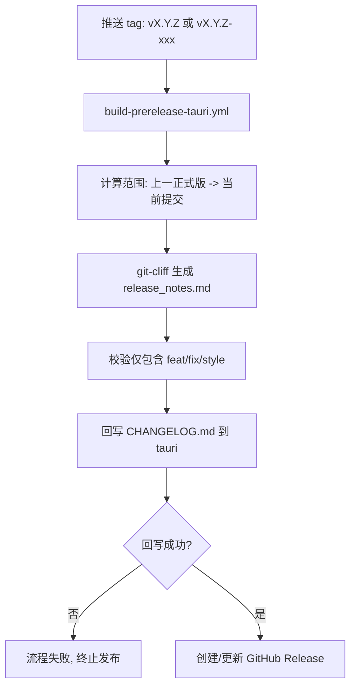

# 自动生成 CHANGELOG 与 GitHub Actions 集成实施规范（定版）

## 1. 文档目的

本文档是 `BiFangKNT/mtga` 的发布说明与 `CHANGELOG.md` 自动化实施规范，直接用于落地，不再是候选方案对比。

目标：

- 用一套流程同时生成 GitHub Release body 和仓库 `CHANGELOG.md`
- 彻底消除“人工复制发布说明到 changelog”的步骤
- 在 Release 页面和 `CHANGELOG.md` 中都输出可点击的 commit 链接

## 2. 定版决策（不可变约束）

以下规则为本仓库当前定版策略：

1. 方案固定为 `git-cliff` + GitHub Actions。
2. 仅 `feat` / `fix` / `style` 三类提交进入发布说明与 `CHANGELOG.md`。
3. 发布范围固定为：`上一正式版 tag` 到 `当前发布提交`。
4. 自动回写 `CHANGELOG.md` 的目标分支固定为 `tauri`。
5. 强一致策略：`CHANGELOG.md` 更新或推送失败时，发布流程整体失败，不创建/更新 Release。
6. commit hash 必须输出为 Markdown 显式链接，不依赖 GitHub autolink。

## 3. 现状与根因

当前 `.github/workflows/build-prerelease-tauri.yml` 里通过 `git log` + Bash 分类生成 `release_notes.md`，并手工复制到 `CHANGELOG.md`。问题在于：

- 维护成本高，容易遗漏或复制错误
- `CHANGELOG.md` 中的裸 SHA 在仓库文件场景不会自动变超链接

因此必须在生成阶段直接产出 inline link，例如：

- `[3587ada](https://github.com/<owner>/<repo>/commit/3587ada37488acdabc0f56393069b82377fdf5e1)`

## 4. 目标流程



## 5. `cliff.toml` 定版配置

建议文件路径：仓库根目录 `cliff.toml`。

```toml
[changelog]
body = """
## {{ version }} - {{ timestamp | date(format="%Y-%m-%d") }}


### {{ group }}

- {{ commit.message | split(pat="\n") | first | trim }} ([{{ commit.id | truncate(length=7, end="") }}](https://github.com/{{ remote.github.owner }}/{{ remote.github.repo }}/commit/{{ commit.id }}))



"""
trim = true

[git]
conventional_commits = true
filter_unconventional = true

# 用于识别仓库版本标签（正式版与预发布版）
tag_pattern = "^v[0-9]+\\.[0-9]+\\.[0-9]+(-.*)?$"

commit_parsers = [
  # 防止未来规则放开时把自动回写提交纳入 changelog
  { message = "^docs\\(changelog\\):", skip = true },

  { message = "^feat",  group = ":sparkles: 新功能" },
  { message = "^fix",   group = ":bug: 修复" },
  { message = "^style", group = ":art: 界面样式" },

  # 其他类型一律忽略，确保仅三类进入产出
  { message = ".*", skip = true },
]
```

## 6. Workflow 改造规范

改造目标文件：`.github/workflows/build-prerelease-tauri.yml` 的 `create-release` job。

### 6.1 必要步骤顺序

1. `checkout`（`fetch-depth: 0`）
2. 计算发布范围（上一正式版 -> 当前提交）
3. 生成 `release_notes.md`
4. 回写 `CHANGELOG.md` 并 push 到 `tauri`
5. 创建/更新 GitHub Release

该顺序不可调整。第 4 步失败时必须终止，不执行第 5 步。

### 6.2 范围计算（必须显式）

必须显式计算上一正式版，不使用“自动推断最近标签”的模糊语义。

```yaml
- name: Resolve release range (previous stable -> current)
  run: |
    set -euo pipefail

    CURRENT_TAG="$TAG_NAME"
    PREV_STABLE_TAG=$(git tag -l 'v*' --sort=-version:refname \
      | grep -E '^v[0-9]+\.[0-9]+\.[0-9]+$' \
      | grep -Fvx "$CURRENT_TAG" \
      | head -n 1)

    if [ -z "$PREV_STABLE_TAG" ]; then
      echo "❌ 未找到上一正式版标签"
      exit 1
    fi

    FROM_COMMIT=$(git rev-parse "$PREV_STABLE_TAG^{commit}")
    TO_COMMIT="${GITHUB_SHA}"

    echo "PREV_STABLE_TAG=$PREV_STABLE_TAG" >> "$GITHUB_ENV"
    echo "FROM_COMMIT=$FROM_COMMIT" >> "$GITHUB_ENV"
    echo "TO_COMMIT=$TO_COMMIT" >> "$GITHUB_ENV"
```

### 6.3 生成发布说明（release_notes.md）

```yaml
- name: Generate release notes via git-cliff
  uses: orhun/git-cliff-action@v4
  with:
    version: latest
    config: cliff.toml
    args: --strip header,footer "$FROM_COMMIT..$TO_COMMIT"
  env:
    OUTPUT: release_notes.md
    GITHUB_REPO: ${{ github.repository }}
    GITHUB_TOKEN: ${{ secrets.GITHUB_TOKEN }}
```

### 6.4 回写 changelog（强一致）

```yaml
- name: Commit and push CHANGELOG.md
  run: |
    set -euo pipefail

    git config user.name "github-actions[bot]"
    git config user.email "41898282+github-actions[bot]@users.noreply.github.com"

    # 避免 detached HEAD 直接推送导致重跑/并发场景下非快进失败
    git fetch origin tauri
    git checkout -B tauri origin/tauri

    # 保留标题并将最新 release notes 插到最前
    if [ -f CHANGELOG.md ]; then
      tail -n +3 CHANGELOG.md > .changelog_rest.md || true
    else
      : > .changelog_rest.md
    fi

    {
      echo "# CHANGELOG"
      echo
      cat release_notes.md
      echo
      cat .changelog_rest.md
    } > CHANGELOG.md

    git add CHANGELOG.md
    git commit -m "docs(changelog): update for ${{ github.ref_name }}"
    git push origin tauri
```

说明：

- 不使用 `|| echo "No changes"` 吞错。若无变更时可按仓库偏好决定是否改为显式跳过。
- 先同步并切到 `origin/tauri` 再提交，避免 tag 重跑或并发提交时出现非快进推送失败。
- 当前定版策略是“失败即中止发布”，因此回写步骤必须严格失败即退出。

### 6.5 创建 Release

仅在 `CHANGELOG.md` 推送成功后执行。

```yaml
- name: Create GitHub Release
  uses: ncipollo/release-action@v1
  with:
    tag: ${{ needs.prepare-version.outputs.tag_name }}
    name: ${{ needs.prepare-version.outputs.release_name }}
    bodyFile: release_notes.md
    prerelease: ${{ needs.prepare-version.outputs.release_type != 'release' }}
    draft: false
    artifacts: |
      artifacts/windows-artifacts/*.exe
      artifacts/macos-x64-artifacts/*.dmg
      artifacts/macos-arm64-artifacts/*.dmg
    token: ${{ secrets.GITHUB_TOKEN }}
```

## 7. 验收清单（按顺序执行）

1. 本地 dry-run 生成
- 执行 `git-cliff`，确认每条记录带 commit inline link。

2. 分类验证
- 造一组 `feat`、`fix`、`style`、`docs(changelog)` 提交并打测试 tag。
- 验证产出仅包含前三类。

3. 范围验证
- 连续打两个预发布 tag 后再打正式版。
- 验证正式版范围仍从“上一正式版”开始，而不是从最近预发布开始。

4. 强一致验证
- 人为制造 `git push origin HEAD:tauri` 失败。
- 验证 workflow 在 changelog 回写步骤失败并停止，不创建 Release。

5. 可点击验证
- 在 Release 页面与 `CHANGELOG.md` 中分别点击 commit 链接，均可跳转到对应 commit 页面。

## 8. 回退方案

若上线后需紧急回退：

1. 将 `create-release` job 的“git-cliff + changelog 回写”步骤整体注释/移除。
2. 恢复到现有 `git log` + Bash 的 `release_notes.md` 生成逻辑。
3. 保持构建产物上传与 release-action 步骤不变，先保证发布可用性。

## 9. 本次重构相对旧文档的关键修正

1. 从“研究/比较方案”改为“定版实施规范”。
2. 明确仅三类提交进入产出，避免示例 parser 与实际策略冲突。
3. 明确发布范围固定为“上一正式版 -> 当前提交”。
4. 明确强一致失败策略：changelog 回写失败即发布失败。
5. 保留 `tauri` 作为固定回写目标分支。
