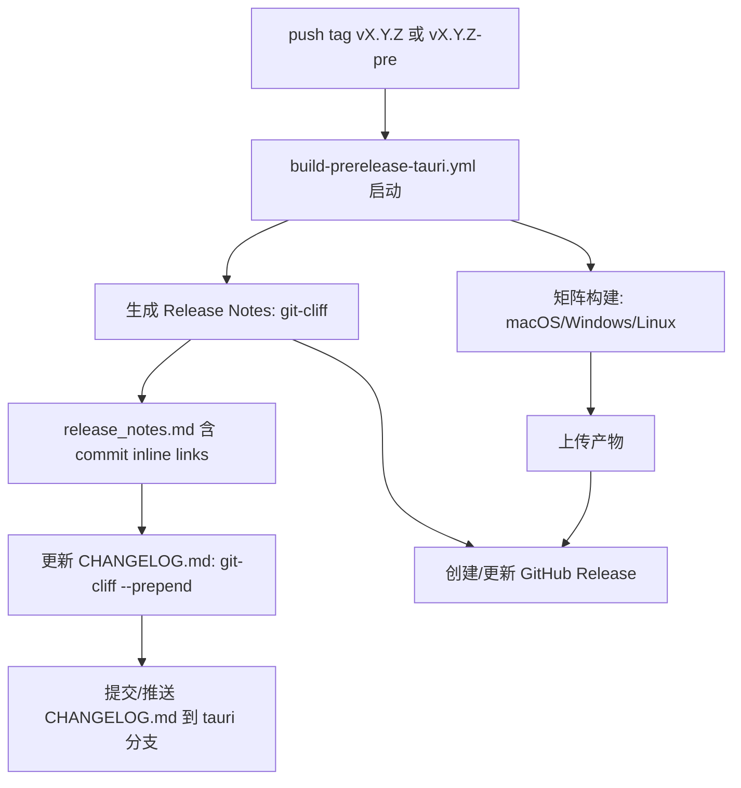

# 自动生成 CHANGELOG 与 GitHub Actions 集成深度研究报告

## 执行摘要

你当前在 `BiFangKNT/mtga` 的预发布/发布流水线里，用 `.github/workflows/build-prerelease-tauri.yml` 里的 Bash 逻辑从 `git log` 生成 `release_notes.md`，再用 Release Action 发布到 GitHub Releases；随后**人工复制**这些发布说明到仓库根目录的 `CHANGELOG.md`。这一做法的主要痛点有两类：其一是**维护成本高**（复制 + 手动修正）；其二是你明确指出的**提交哈希链接渲染不一致**：在 Release 页面里提交 SHA 会被转成可点击短链接，但在仓库 Markdown 文件（如 `CHANGELOG.md`）里不会自动变成链接，因此你希望输出 **inline link**（`[abc1234](.../commit/abc1234...)`）以保证一致性。

这类“Release 页面自动短链接、仓库文件不自动短链接”的现象，和 GitHub 的“自动链接引用（autolinked references）在对话场景生效、但在仓库文件/维基不生效”的规则相吻合；GitHub 文档明确提示：自动链接引用**不会在仓库文件或 wiki 中创建**，并且对 commit SHA 的短链接行为属于该自动链接引用体系的一部分。

综合你仓库现状（提交信息大量采用 `feat/fix/style(scope): ...` 的 Conventional Commits 风格、tag 使用 `vX.Y.Z` 与 `vX.Y.Z-...`），以及你对“现代化工具 + GitHub Actions 集成 + 可定制模板/中文输出 + 自动生成 commit hash inline links + 同步 Release 与 CHANGELOG.md”的优先级，本报告给出三个优先级方案（并额外提供一个“最小改动回退方案”）：

-   **首选：git-cliff（配合 orhun/git-cliff-action）**<br>优点是“高度可定制 + 原生支持 Conventional Commits + 可用模板直接输出 commit 链接/PR 信息 + 支持 `--prepend` 以增量写入 CHANGELOG”，非常适合你当前“用 commit 分类生成说明”的工作流。git-cliff 也提供 GitHub Actions 用法示例与专门的 Action。
    

---

## 仓库现状审查与问题定位

### 现有 CHANGELOG 内容形态与“哈希不链接”的根因

你的 `CHANGELOG.md` 条目大量是类似：

-   `- feat(proxy): 支持运行时热更新代理配置 (3587ada37488acdabc0f56393069b82377fdf5e1)`
    
-   `- fix(gitflow): 执行 release finish 后自动签回开发分支 (b8ed6e5d05cd474926903afa80ddad8302d88681)`
    

这正对应你所说的：“Release 页面里哈希会成为超链接，但在 changelog 中不会”。GitHub 文档指出自动链接引用（包含 commit SHA 短链接）发生在 GitHub Web 交互界面中的对话性内容，但同时强调：**自动链接引用不会在仓库文件或 wiki 中创建**。<br>因此要想在 `CHANGELOG.md` 中点击 commit，最稳妥的方式就是：**生成 Markdown 显式链接**（inline link 或 reference-style link），而不是依赖 GitHub 的 autolink。

### 你当前 workflow 的“生成发布说明”逻辑抽象

虽然本次连接器读取到 workflow 的全文内容（略），但其逻辑可归纳为：

-   基于 `git log <range> --format='%H\t%s'` 获取 commit SHA + subject
    
-   用 `append_release_entry` 将 `feat|fix|style` 分类写入 `release_notes.md`
    
-   release notes 中的 SHA 是“裸文本”（`($hash)`），并未显式写成 Markdown 链接
    
-   将 `release_notes.md` 作为 release body 发布
    
-   之后你人工把内容复制进 `CHANGELOG.md`（同样保留“裸 SHA”）
    

所以“哈希在 changelog 不可点击”并非偶然，而是当前输出格式导致的必然结果（依赖 autolink，本来在文件场景不会触发）。

---

## 需求拆解与评估维度

结合你的研究要求，本报告把需求拆成“必须满足”和“加分项”两组，并据此做工具对比与方案排序。

必须满足（与你当前痛点强绑定）

-   自动生成 release notes，避免在 workflow 中手工维护大段说明（或至少把手写降到“模板级配置”）。
    
-   能把同一份内容同步到 `CHANGELOG.md`（自动写回仓库，或通过 PR 自动更新），消灭“复制粘贴”。
    
-   生成内容必须支持 **commit hash 显式链接**（inline links / reference links），确保在 `CHANGELOG.md` 可点击。
    
-   与 GitHub Actions 集成成本可控，最好能直接嵌入/替换你现有 `build-prerelease-tauri.yml` 中生成 notes 的步骤。
    

加分项（决定长期维护体验）

-   对提交/PR 约定的依赖程度（Conventional Commits、PR labels、squash merge 规范等）。Conventional Commits 规范本身定义了结构化提交头格式（`<type>[scope]: <description>`），可作为自动化工具基础。
    
-   输出格式：Markdown、Keep a Changelog 结构、是否能生成 compare links、是否易做中文标题与 emoji。Keep a Changelog 明确建议 changelog 是为人类阅读、分类清晰、版本可链接，并提供中文版本参考。
    
-   monorepo/多组件支持：是否可按路径/组件出不同 changelog，或按 manifest 管理多个包。
    
-   安全性：第三方 Action 的供应链风险与最小权限配置。GitHub 明确建议对第三方 Action **pin 到不可变 commit SHA**，并审计其行为。
    
-   token/触发链：若自动写回仓库或自动打 tag，是否会影响后续 CI 触发。GitHub 文档说明用 `GITHUB_TOKEN` 触发的事件通常不会触发新的 workflow run（除 `workflow_dispatch`/`repository_dispatch`），这既是防递归机制，也是很多“自动化发布工具”集成时必须考虑的点。

---

## 方案建议与优先级排序

本节给出**1 个可行方案**，并聚焦你的仓库实际：尽量“可直接替换/参考 build-prerelease-tauri.yml”，且都明确解决“commit hash 链接”与“Release/CHANGELOG 同步”。

### 首选方案：git-cliff 统一生成 Release Notes + 自动增量更新 CHANGELOG.md

#### 为什么优先推荐

1.  你现有提交信息已经高度接近 Conventional Commits（`feat/fix/style(scope): ...`），git-cliff 原生支持 Conventional Commits，并允许用 regex parsers 做自定义分组。
    
2.  git-cliff template 可直接输出 `commit.id`，并拼出 commit URL，从根本上解决“裸 SHA 在 `CHANGELOG.md` 不可点击”的问题；此外文档还给出把“裸 hash”替换成链接的 preprocessor 示例。
    
3.  git-cliff CLI 支持 `--prepend`：把新版本条目**插入到现有 changelog 文件**，避免你历史上部分手写内容被覆盖，且适配你现在的“只想新增最新版本”诉求。
    
4.  有现成 `git-cliff-action`，并在官方文档里给出了 Actions 用法。
    

#### 落地步骤

步骤概览：

-   增加 `cliff.toml`（或 `.github/cliff.toml`）定义：分组规则（feat/fix/style/…）、输出模板（中文标题 + emoji）、commit 链接格式。
    
-   在 `build-prerelease-tauri.yml` 的“生成发布说明”位置替换为 git-cliff 生成 `release_notes.md`。
    
-   在创建 Release 前后增加一步：用 git-cliff `--prepend CHANGELOG.md` 写回仓库，并 commit/push（或开 PR）。
    

> 重要安全提示：第三方 Action 建议 pin 到不可变 commit SHA，降低供应链风险。

#### 推荐的 `cliff.toml` 示例（满足你的分组与链接要求）

下面模板重点做了三件事：

-   分组：按 `feat/fix/style` 与其他类型（docs/refactor/chore 等）分组；
    
-   每条 commit 末尾输出 **短 SHA + 显式 commit 链接**；
    
-   通过 `remote.github.owner/repo` 生成链接（在 Action 中用 `GITHUB_REPO` 指定）。
    

```toml
# cliff.toml (建议放仓库根目录)
[changelog]
# 只渲染 body；header/footer 由你决定是否在最终 CHANGELOG 中保留
body = """

## {{ version }} - {{ timestamp | date(format="%Y-%m-%d") }}

## Unreleased



### {{ group }}

- {{ commit.message | split(pat="\n") | first | trim }}
  ([{{ commit.id | truncate(length=7, end="") }}](https://github.com/{{ remote.github.owner }}/{{ remote.github.repo }}/commit/{{ commit.id }}))



"""
trim = true

[git]
conventional_commits = true
filter_unconventional = false

# 只采你关心的 tag：vX.Y.Z 与 vX.Y.Z-xxx
tag_pattern = "^v[0-9]+\\.[0-9]+\\.[0-9]+.*$"

commit_parsers = [
  { message = "^feat",  group = "✨ 新功能" },
  { message = "^fix",   group = "🐛 修复" },
  { message = "^style", group = "🎨 界面样式" },
  { message = "^perf",      group = "⚡ 性能" },
  { message = "^refactor",  group = "🛠️ 重构" },
  { message = "^docs?",     group = "📝 文档" },
  { message = "^test",      group = "🧪 测试" },
  { message = "^(build|chore|ci)", group = "🔧 构建/工程化" },
  { message = "^revert", group = "⏪ 回滚" },
  { message = ".*", group = "📦 其他" },
]

# 如未来你在 commit subject 中包含 #PR，可用 link_parsers 将其转链接
link_parsers = [
  { pattern = "#(\\d+)", href = "https://github.com/{{ remote.github.owner }}/{{ remote.github.repo }}/pull/$1" },
]
```

> 上面模板里使用的 `remote.github.owner/repo`、`commit.id`、`commit.message` 都来自 git-cliff 的 GitHub integration/templating 上下文说明。<br>`commit_preprocessors` 也可以用于把“裸 hash”转换成 Markdown 链接（文档中给出示例正是为了解决类似问题）。

#### 可直接参考的 workflow 片段（替换你现有“生成发布说明”步骤）

以下片段按你的现有流水线习惯设计：仍然生成 `release_notes.md` 供 release body 使用，同时把最新条目 prepend 到 `CHANGELOG.md` 并提交回 `tauri` 分支（也可改为开 PR）。

```yaml
# 在 create-release job 中（你现在生成 release_notes.md 的位置）
- name: Checkout full history
  uses: actions/checkout@v4
  with:
    fetch-depth: 0

- name: Generate release notes via git-cliff
  id: cliff
  uses: orhun/git-cliff-action@v4
  with:
    config: cliff.toml
    # 关键：只生成当前 tag 这一次 release 的 body（也可以用 RANGE 精确控制）
    args: --current --strip header,footer
  env:
    OUTPUT: release_notes.md
    GITHUB_REPO: ${{ github.repository }}
    GITHUB_TOKEN: ${{ secrets.GITHUB_TOKEN }}

- name: Update CHANGELOG.md (prepend)
  # 生成同一份内容并 prepend 到 CHANGELOG
  run: |
    git cliff --config cliff.toml \
      --current \
      --prepend CHANGELOG.md \
      --output CHANGELOG.md \
      --github-repo "${GITHUB_REPO}" \
      --github-token "${GITHUB_TOKEN}"

- name: Commit CHANGELOG back to repo
  run: |
    git config user.name  "github-actions[bot]"
    git config user.email "41898282+github-actions[bot]@users.noreply.github.com"
    git add CHANGELOG.md
    git commit -m "docs(changelog): update for ${{ github.ref_name }} [skip ci]" || echo "No changes"
    git push origin HEAD:tauri
  env:
    GITHUB_REPO: ${{ github.repository }}
    GITHUB_TOKEN: ${{ secrets.GITHUB_TOKEN }}
```

说明与注意点：

-   `git-cliff-action` 官方文档要求 checkout `fetch-depth: 0`，否则 tag/历史不足会导致范围计算错误。
    
-   git-cliff `--prepend` 是官方 CLI 选项（“Prepends entries to the given changelog file”）。
    
-   如果你选择“push 回分支”，要理解 GitHub 的触发链规则：用 `GITHUB_TOKEN` 推送造成的 `push` 通常不会触发新的 workflow（防止递归）。这对“只想更新 CHANGELOG、不想引发额外 CI”反而是优点；如果你确实想触发后续 CI，需要改用 PAT 或 GitHub App token。
    

#### 如何精准解决“commit hash 链接”问题

-   根因：仓库文件不会自动生成 autolinked references，不能指望裸 SHA 自动变链接。
    
-   git-cliff 的解决方式：在模板里显式输出 Markdown 链接，例如：<br>`([{{ short_sha }}](https://github.com/<owner>/<repo>/commit/{{ full_sha }}))`<br>这样无论出现在 Release body 还是 `CHANGELOG.md`，都稳定可点击。
    
-   如果你还想“兼容旧内容”（历史里已有裸 SHA），可以用 git-cliff 的 `commit_preprocessors` 或 changelog `postprocessors` 做正则替换（文档示例直接给出了“把裸 hash 转成链接”模式）。  

---

## CI 流程变更示意与验证清单

### 推荐目标流程（以 git-cliff 方案为例）



说明：

-   “commit hash inline links”在生成阶段完成，因此 Release 页面与 `CHANGELOG.md` 都一致可点。
    
-   如果你用 `GITHUB_TOKEN` 推送 changelog 更新，通常不会触发额外 workflow run（防递归）；这是预期行为。
    

### 测试与验证步骤（强烈建议按顺序）

1.  **本地验证 git-cliff 配置**
    
    -   在本地仓库执行：`git cliff --config cliff.toml --current --strip header,footer`
        
    -   检查输出分组是否符合预期（feat/fix/style 是否进入对应分组）。Conventional Commits 结构的定义可对照规范。
        
2.  **验证 commit 链接格式**
    
    -   确认每条 commit 后是 `[短SHA](https://github.com/<owner>/<repo>/commit/<长SHA>)`。
        
    -   这是避免依赖 autolink 的关键。
        
3.  **在 GitHub Actions 新建一个测试 tag（例如** `v2.2.1-test.0`**）**
    
    -   观察 `release_notes.md` 是否生成、release body 是否正确。
        
4.  **验证 CHANGELOG 更新是否增量**
    
    -   确认历史手写段落未被覆盖；只新增最新版本块。
        
    -   `--prepend` 的语义是“把新条目 prepend 到指定 changelog 文件”。
        
5.  **验证权限与安全**
    
    -   最小权限原则：只在需要写回 changelog/release 的 job 中开放 `contents: write`。
        
    -   第三方 Action 最好 pin SHA（GitHub 官方安全建议）。
        
6.  **回退演练**
    
    -   把 workflow 中 git-cliff 步骤用条件开关（例如 `if: inputs.use_git_cliff == 'true'`）控制。
        
    -   一旦失败可立即回滚到旧的 `git log` 生成方式（保证发布不中断）。
        